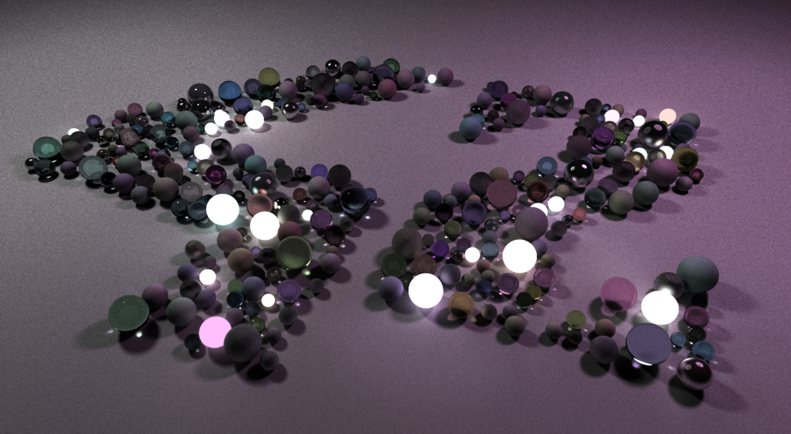

*This project has been created as part of the 42 curriculum by tpotier and pberne.*

# miniRT




A minimal CPU Path Tracer developed in C

## Description

miniRT is a project from the 42 School Common Core that introduces the fundamental concepts of Ray Tracing and 3D computer graphics. The goal is to generate realistic images by simulating the physical behavior of light.

Unlike rasterization (used in most real-time games), this engine casts rays from a virtual camera through each pixel into a 3D scene, calculating intersections with objects and determining the final color based on:

* **Geometric Intersections:** Analytical solutions for Spheres, Planes, Quads, Triangles, Cylinders and Ellipsoids
* **The Phong Reflection Model:** Implementing Ambient, Diffuse, and Specular lighting.

* **Shadows:** Checking for obstructions between the hit point and light sources.

## Prerequisites

MiniLibX for Linux requires xorg, x11 and zlib, therefore you will need to install the following dependencies: xorg, libxext-dev and zlib1g-dev. Installing these dependencies on Ubuntu can be done as follows:

	sudo apt-get update && sudo apt-get install xorg libxext-dev zlib1g-dev libbsd-dev

### Compilation

Build the project using the provided Makefile:

	make
*Other commands: ```make clean```, ```make fclean```, ```make re```.*

### Run
	./mini-rt scene.rt

## Features

### 🕯️ Rendering & Illumination

* **Path Traced Global Illumination:** Full support for indirect lighting, allowing light to bounce off surfaces and illuminate dark areas.
* **Multiple Importance Sampling (MIS):** A robust sampling strategy that combines BRDF sampling and Direct Light sampling to significantly reduce variance (noise) in scenes with both large area lights and small, bright points.
* **Emissive Surfaces:** Spheres and quads can be turned into light sources by assigning them a , allowing for realistic area lighting.
* **Point Lights:** Support for traditional point light sources.
* **Refraction & Reflection:** Accurate simulation of Fresnel effects, allowing for realistic glass (dielectrics) and polished metals (conductors).
* **Volumetric Fog/Lighting:** A fog density can be defined to allow rays to bounce in the atmosphere before hitting objects. This allow the air to be lit and shadowed creating god rays and volumetric shadows.

### ⚡ Performance & Optimization
* **Bounding Volume Hierarchy (BVH):** Implemented a tree-based spatial partition to reduce ray-object intersection complexity. It uses Axis-Alligned Bounding Boxes to maximize the intersection speed, enabling the rendering of scenes with **tens of thousands** of primitives.
* **SIMD Vectorization:** Leveraged **SIMD (Single Instruction, Multiple Data)** instructions to process multiple floating-point calculations in parallel, specifically for ray-box intersection and vector math.
* **Multi-threading:** Implemented using `pthread` to distribute the rendering workload across all available CPU cores. By dividing the image into lines, the engine achieves near-linear scaling in performance.


# Scene format

A scene can contain any number of elements declared in any order but should follow those specifications:

* It must contain at least one Camera (C).
* It must contain one and only one Ambient Light (A);

Each elements contains a prefix and each line must respect the attributes order that are required for this prefix.

### Elements

**Camera:**
		
		position		direction		fov

	C	1.0 2.0 3.0		0.0 0.0 1.0		80

**Ambient Light:**

		intensity		color RGB[0-255]		fog density		ray_bounces[0-127]

	A	1.0				32 32 32				0.001			1

**Spot Light:**

		position		intensity		color RGB[0-255]

	L	1.0 2.0 3.0		1.0				255 42 24

**Texture:**

		relative path

	tex	Textures/texture_name.xpm

*Texture have an id assigned in the order they are declared **starting from 2**, the second texture will have its id to 3 etc ...*

*Only .xpm texture are supported*


### Objects

Object are defined by their respective properties but they must all end with the material definition.

**Material:**

	color RGB[0-255]		diffusion	specularity		emission	refraction	colorID		normalID
	255 255 255 			0.2			0.4 			2.0 		1.3			0			0

**Notes on material limitations:**

* A material with an emission greater than 0 will ignore diffusion, specularity and refraction.
* A material with a refraction index greater than 0 will be transparfent, and will ignore specularity.
* colorId and normal ID refers to ID of declared textures
	
	* **id 0:** used for untextured material, the raw color will be used.
	* **id 1, -1:** Used for untextured checkered, colors will be inverted in a chekerboard pattern./
	* **id >= 2:** refers to the index of the texture to use.
	* **id <= -2:** the negative sign is used to inverse the texture color in a checkered pattern.
 

**Sphere:**

		position		radius		material
	sp	1.0 2.0 3.0		42.0		* * *   * * * *   * *

**Plane**

		position		normal			material
	pl	1.0 2.0 3.0		0.0 1.0 0.0		* * *   * * * *   * *

**Cylinder**

		position		axis			diameter	height		material
	cy	1.0 2.0 3.0		1.0 0.0 0.0		24.5		42.2		* * *   * * * *   * *

**Quad**

		position		normal			width		height		material
	q	1.0 2.0 3.0		0.0 1.0 0.0		42.0		24.8		* * *   * * * *   * *

**Triangle**

		vertex 0		vertex 1		vertex 2			material
	t	0.0 0.0 0.0		0.0 10.0 0.0	10.0 10.0 0.0		* * *   * * * *   * *

**Ellipsoid**

		position		radii XYZ			material
	el	1.0 2.0 3.0		25.0 50.0 75.0		* * *	* * * *   * *

## Controls


| Action      		| Key(s) |	Notes|
| :---        		|    :----:   | ---:|
| Camera Movement	| <kbd>W</kbd> <kbd>A</kbd> <kbd>S</kbd> <kbd>D</kbd>  <kbd>ctrl</kbd> <kbd>space</kbd>|
| Camera Rotation	| <kbd>Mouse</kbd> <kbd>I</kbd> <kbd>J</kbd> <kbd>K</kbd> <kbd>L</kbd> | Toggle mouse control with ALT|
| Camera FOV		| <kbd>Scroll Wheel</kbd>
| Add/Remove Camera	| <kbd>=</kbd> <kbd>-</kbd> | Copies the selected camera |
| Object selection	| <kbd>Left CLick</kbd> |
| Move Selected		| <kbd>↑</kbd> <kbd>←</kbd> <kbd>↓</kbd> <kbd>→</kbd> <kbd>num +</kbd> <kbd>num -</kbd>| Hold <kbd>Right Click</kbd> to move objects faster
| Rotate Selected (X)	| <kbd>num 0</kbd> <kbd>num 1</kbd>	|
| Rotate Selected (Y)	| <kbd>num 2</kbd> <kbd>num 3</kbd>	|
| Rotate Selected (Z)	| <kbd>num 5</kbd> <kbd>num 6</kbd>	|
| Selected Control 2	| <kbd>num /</kbd> <kbd>num *</kbd>	|
| Select Point Lights	| <kbd>PgUp</kbd> <kbd>PgDn</kbd> |	Selects or cycle through Point Lights
| Ray Bounce --/++		| <kbd>F</kbd> <kbd>G</kbd> | Hold <kbd>Right Click</kbd> to increment/decrement 10x faster
| Display Normals		| <kbd>N</kbd>
| Display BVH			| <kbd>E</kbd>
| Exit					| <kbd>Esc</kbd>

## Use of AI

* LLMs were used as advanced search engines to help us discover some optimisation concepts and best practices used in ray tracing. It guided us towards very interesting research material that greatly contributed to this project.
* It assisted us in verifying / debugging for some calculations.
* AI was used to generate scripts that procedurally create complex scenes with thousands of object to test the BVH.
* It assisted us for the structure of this README.

## Ressources

* [Ray Tracing in one weekend](https://raytracing.github.io/books/RayTracingInOneWeekend.html)
* [Coding Adventures - Ray Tracing](https://www.youtube.com/watch?v=Qz0KTGYJtUk&list=PLFt_AvWsXl0dlgwe4JQ0oZuleqOTjmox3)
* [The Algorithm That Makes Ray Tracing 10x Faster](https://youtu.be/p772XkEnEIU)
* [How to build a BVH](https://jacco.ompf2.com/2022/04/13/how-to-build-a-bvh-part-1-basics/)
* [Primitive Intersectors](https://iquilezles.org/articles/intersectors/)

